<p align="center">
  
  <h1 align="center">TLEX - Telegram Media Server</h1>
</p>

<p align="center">
  A powerful, self-hosted <b>Telegram Media Server</b> built with <b>FastAPI</b>, <b>PostgreSQL</b>, and <b>Pyrogram</b> — seamlessly integrated with <b>Next.js</b> for a modern, Plex-like streaming experience.
</p>

<p align="center">
  
  
  
  
  
  
  
  
  
  
</p>

---

## ✨ Features

### 🚀 Core Architecture
- **Telegram as Storage**: Uses Telegram channels as a persistent, unlimited storage layer. No local hard drives required for media.
- **Worker Pool System**: Manages multiple Telegram accounts ("workers") to parallelize downloads and bypass bandwidth limits or `FloodWait` (Rate Limits) automatically.
- **Virtual Streaming**: Streams video files directly from Telegram to the client without downloading the entire file first. Supports seeking and range requests.
- **Smart Caching**: Hybrid caching system (Redis + Disk) to optimize frequent access and reduce API calls.

### 🎥 Media Experience
- **Modern Web Player**: Custom video player built with React, supporting multiple audio tracks and subtitles.
- **TMDB Integration**: Automatically fetches high-quality metadata, posters, and backdrops for Movies and TV Series.
- **Advanced Subtitles**: Native support for SSA/ASS subtitles using **SubtitleOctopus (via libass-wasm)**, fully preserving complex anime-style typesetting, fonts, and animations in the browser.
- **Subtitle Sync**: Manual audio/subtitle synchronization offset adjustment (+/- 20s) directly in the player.
- **Transcoding**: Automatic conversion of unsupported formats (e.g., mkv container features) to browser-compatible streams.

### 👤 User Experience
- **Multi-Profile**: Create multiple profiles per account (Netflix-style), including Kids Mode and separate language preferences.
- **Continue Watching**: Automatic progress tracking. Resume movies and episodes exactly where you left off across devices.
- **Watchlist**: Save content to your personal list for later viewing.

### 🛠️ Tech Stack
- **Backend**: Python (FastAPI), SQLAlchemy (Async), Pyrogram (Telegram Client).
- **Frontend**: Next.js 16, React 19, Tailwind CSS v4, Framer Motion.
- **Infrastructure**: Docker, PostgreSQL (Data), Redis (Cache/Locks), Cloudflared (Tunneling).

---

## 🏗️ Architecture

```mermaid
graph TD
    subgraph Client ["🖥️ Client Side"]
        User([👤 User]) <-->|HTTPS| Browser[Web Browser]
    end

    subgraph Infrastructure ["☁️ TLEX Infrastructure"]
        Tunnel[Cloudflared Tunnel]
        
        subgraph Docker ["🐳 Docker Services"]
            Frontend[⚛️ Next.js Frontend]
            Backend[🚀 FastAPI Backend]
            
            DB[(🐘 PostgreSQL)]
            Redis[(⚡ Redis Cache)]
            
            Backend <-->|ORM| DB
            Backend <-->|Pub/Sub| Redis
        end
        
        Browser <-->|Secure Tunnel| Tunnel
        Tunnel <-->|HTTP| Frontend
        Tunnel <-->|API / Stream| Backend
    end

    subgraph External ["🌍 External Services"]
        Telegram[✈️ Telegram Cloud]
        TMDB[🎬 TMDB API]
    end

    Backend <-->|Metadata| TMDB
    Backend <-->|MTProto Load Balanced| Telegram
    

```



---

## 🚀 Getting Started

### Prerequisites
- Docker & Docker Compose
- A Telegram API ID & Hash (from [my.telegram.org](https://my.telegram.org))
- At least one Telegram account to act as a worker

### Installation

1.  **Clone the repository**
    ```bash
    git clone https://github.com/your/tlex.git
    cd tlex
    ```

2.  **Configure Environment**
    Copy the example configuration:
    ```bash
    cp .env.example .env
    ```
    Edit `.env` and fill in your details:
    - `API_ID` / `API_HASH`: Your Telegram App credentials.
    - `POSTGRES_PASSWORD`: Secure database password.
    - `JWT_SECRET`: Random string for security.

3.  **Start Services**
    ```bash
    docker-compose up -d --build
    ```

4.  **Access the Platform**
    - **Web UI**: [http://localhost:3000](http://localhost:3000)
    - **API Docs**: [http://localhost:8000/docs](http://localhost:8000/docs)
    - **pgAdmin**: [http://localhost:5050](http://localhost:5050) (Login with email/pass from `.env`)
    - **Remote Access (Quick Tunnel)**:
        Check the logs to get your temporary `trycloudflare.com` URL:
        ```bash
        docker logs tlex-cloudflared
        ```

### First Run Setup
1.  **Add Workers**: You need to authenticate at least one Telegram account.
    - Go to the **Settings / Workers** page in the Web UI.
    - Click **Add Worker** and follow the phone number verification flow.
2.  **Scan Channels**:
    - Configure `SCANNER_CHANNEL_IDS` in your `.env`.
    - Trigger a scan via the API or specific dashboard button to populate your library.

---

## ⚙️ Configuration

Key environment variables in `.env`:

| Variable | Description | Default |
|----------|-------------|---------|
| `API_ID` | Telegram API ID | Required |
| `API_HASH` | Telegram API Hash | Required |
| `POSTGRES_USER` | Database User | `tlex` |
| `POSTGRES_DB` | Database Name | `tlex_db` |
| `SCANNER_CHANNEL_IDS` | Comma-separated list of Channel/Group IDs to scan | |
| `SCANNER_MOVIES_TOPIC_ID` | Specific Topic ID where you upload Movies | |
| `TMDB_API_KEY` | Key for fetching media metadata | |

### 📚 Library Setup

To organize your library, you **must** use a private Telegram Group with **Topics enabled** (Forum).

1.  **Enable Topics**: Convert your group to a Supergroup and enable "Topics" in settings.
2.  **Configure ID**: Copy the Group ID (e.g., `-100xxxx`) to `SCANNER_CHANNEL_IDS`.
3.  **Movies Setup**:
    - Create a topic named "Movies" (or similar).
    - Copy its `Thread ID` (Topic ID) to `SCANNER_MOVIES_TOPIC_ID` in `.env`.
    - Upload movie files here (e.g., `Matrix.1999.1080p.mkv`). TLEX will guess title and year from the filename.
4.  **TV Series Setup**:
    - Create a **separate topic for EACH TV Series**.
    - **Name the topic exactly as the Series Name** (e.g., `Breaking Bad`).
    - Upload episode files here (e.g., `S01E01.mkv`).
    - TLEX uses the **Topic Name** to identify the series and the filename for S/E detection.

---

## 🤝 Contributing

Contributions are welcome! Please read `CONTRIBUTING.md` for details on our code of conduct, and the process for submitting pull requests.

## 📄 License

This project is licensed under the MIT License - see the `LICENSE` file for details.

---

## ⚠️ Disclaimer

**TLEX is strictly for educational and research purposes.**

- The developers of this project do not host, distribute, or promote any copyrighted content.
- This software is a client interface for the Telegram API. Users are solely responsible for the content they access and store.
- You must comply with Telegram's Terms of Service and the copyright laws of your country.
- The developers are not liable for any misuse of this software.
